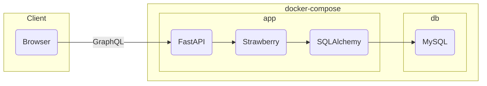

# pokeapi-graphql

[](https://www.python.org/)
[](https://codecov.io/gh/kohdice/pokeapi-graphql)

GraphQL API of Pokédex

## 1. Table of Contents

- [1. Table of Contents](#1-table-of-contents)
- [2. About This Repository](#2-about-this-repository)
- [3. Usage](#3-usage)

  - [a. Install Docker](#a-install-docker)
  - [b. Clone Repository](#b-clone-repository)
  - [c. Run servers](#c-run-servers)
  - [d. Health Check](#d-health-check)
  - [e. Access GraphQL Playground](#e-access-graphql-playground)

- [4. Scripts](#4-scripts)
- [5. Architecture](#5-architecture)
- [6. Directory Structure](#6-directory-structure)
- [7. Demo](#7-demo)
  - [Get Pokémons](#get-pokémons)
  - [Authentication](#authentication)
  - [Get User](#get-user)

## 2. About This Repository

This is a repository for a GraphQL API that returns Pokémon data,
created with [FastAPI](https://fastapi.tiangolo.com/) and [Strawberry](https://strawberry.rocks/).

## 3. Usage

### a. Install Docker

Download and install Docker Desktop from the [Docker official website](https://www.docker.com/products/docker-desktop/).

### b. Clone Repository

[Clone this repository](https://github.com/kohdice/pokeapi-graphql)
to your development machine and create a local repository

### c. Run Servers

Execute the following command.

```bash
docker compose up --build
```

### d. Health Check

Execute the following command.

```bash
curl -X GET http://localhost:8000/health
```

If `{"status": "OK"}` is returned, server setup is successful.

### e. Access GraphQL Playground

- [http://localhost:8000/graphql](http://localhost:8000/graphql)

## 4. Scripts

Run the following commands in the Docker container.

- Run tests (Testing by pytest)

```bash
task test
```

- Run formatters (Formatting by ruff)

```bash
task fmt
```

- Run linters (Static code analysis by ruff)

```bash
task lint
```

## 5. Architecture



## 6. Directory Structure

```bash
pokeapi-graphql/
├── pokeapi/
│   ├── application/            # Application Layer
│   │   ├── services/           # Application Services
│   │   │   └── ...
│   │   └── ...
│   ├── dependencies/           # Dependency Injection
│   │   ├── di/                 # DI-related
│   │   │   └── ...
│   │   ├── settings/           # Settings
│   │   │   └── ...
│   │   └── ...
│   ├── domain/                 # Domain Layer
│   │   ├── entities/           # Entity Classes
│   │   │   └── ...
│   │   ├── repositories/       # Repository Interfaces
│   │   │   └── ...
│   │   ├── services/           # Domain Services
│   │   │   └── ...
│   │   └── ...
│   ├── exceptions/             # Custom Exceptions
│   │   └── ...
│   ├── infrastructure/         # Infrastructure Layer
│   │   ├── database/           # Database Connections, etc.
│   │   │   ├── models/         # Database Models
│   │   │   │   └── ...
│   │   │   ├── repositories/   # Implementation of Database Repositories
│   │   │   │   └── ...
│   │   │   └── ...
│   │   └── ...
│   ├── presentation/           # Presentation Layer
│   │   ├── helpers/            # Helper functions
│   │   │   └── ...
│   │   ├── resolvers/          # Resolver functions
│   │   │   └── ...
│   │   ├── schemas/            # Schema Classes
│   │   │   └── ...
│   │   ├── validators/         # Validator Classes
│   │   │   └── ...
│   │   └── ...
│   ├── main.py                 # Application Entry Point
│   └── ...
├── tests/                      # Test Code
│   └── ...
├── schema.graphql              # Definition of GraphQL schema
└── ...
```

## 7. Demo

### Get Pokémons

- GraphQL

```graphql
query {
  pokemons(first: 3) {
    pageInfo {
      hasNextPage
      hasPreviousPage
      startCursor
      endCursor
    }
    edges {
      cursor
      node {
        id
        nationalPokedexNumber
        name
      }
    }
  }
}
```

- curl

```bash
curl -Ss -X POST \
-H "Content-Type: application/json" \
-d '{"query": "query { pokemons(first:3) { pageInfo { hasNextPage hasPreviousPage startCursor endCursor } edges { cursor node { id nationalPokedexNumber name } } } }"}' \
http://localhost:8000/graphql | jq .
```

- Response

```bash
{
  "data": {
    "pokemons": {
      "pageInfo": {
        "hasNextPage": true,
        "hasPreviousPage": false,
        "startCursor": "YXJyYXljb25uZWN0aW9uOjA=",
        "endCursor": "YXJyYXljb25uZWN0aW9uOjI="
      },
      "edges": [
        {
          "cursor": "YXJyYXljb25uZWN0aW9uOjA=",
          "node": {
            "id": "UG9rZW1vbjox",
            "nationalPokedexNumber": 1,
            "name": "フシギダネ"
          }
        },
        {
          "cursor": "YXJyYXljb25uZWN0aW9uOjE=",
          "node": {
            "id": "UG9rZW1vbjoy",
            "nationalPokedexNumber": 2,
            "name": "フシギソウ"
          }
        },
        {
          "cursor": "YXJyYXljb25uZWN0aW9uOjI=",
          "node": {
            "id": "UG9rZW1vbjoz",
            "nationalPokedexNumber": 3,
            "name": "フシギバナ"
          }- GraphQL      }
      ]
    }
  }
}
```

### Authentication

- Sample User

```bash
{
  "username": "Red",
  "password": "password"
}
```

- Graphql

```graphql
mutation {
  auth(input: { username: "Red", password: "password" }) {
    ... on AuthResult {
      accessToken
      refreshToken
      tokenType
    }
    ... on AuthErrors {
      message
    }
  }
}
```

- curl

```bash
curl -Ss -X POST \
-H "Content-Type: application/json" \
-d '{"query": "mutation { auth(input: { username: \"Red\", password: \"password\" }) { ... on AuthResult { accessToken refreshToken tokenType } ... on AuthErrors { message } } }"}' \
http://localhost:8000/graphql | jq .
```

- Response

```bash
{
  "data": {
    "auth": {
      "accessToken": "ISSUED_ACCESS_TOKEN",
      "refreshToken": "ISSUED_REFRESH_TOKEN",
      "tokenType": "Bearer"
    }
  }
}
```

### Get User

- GraphQL

```graphql
query {
  user {
    ... on User {
      username
    }
    ... on UserErrors {
      message
    }
  }
}
```

- curl

```bash
curl -Ss -X POST \
-H "Content-Type: application/json" \
-H "Authorization: Bearer YOUR_ACCESS_TOKEN" \
-d '{"query": "query { user { ... on User { username } ... on UserErrors { message } } }"}' \
http://localhost:8000/graphql | jq .
```

- Response

```bash
{
  "data": {
    "user": {
      "username": "Red"
    }
  }
}
```
